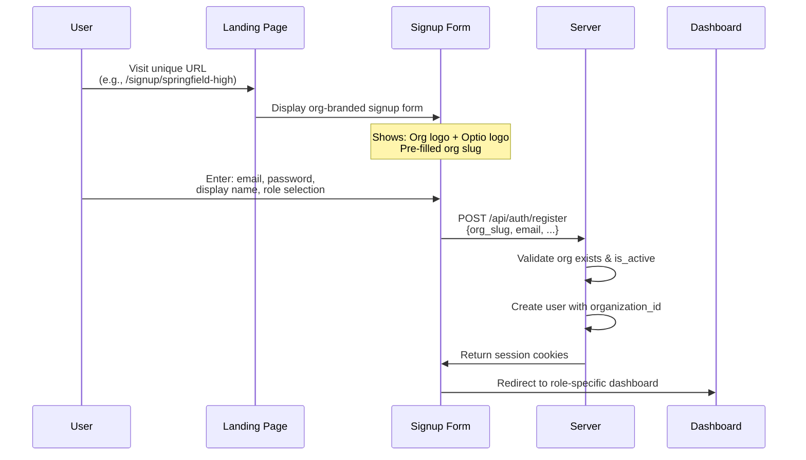
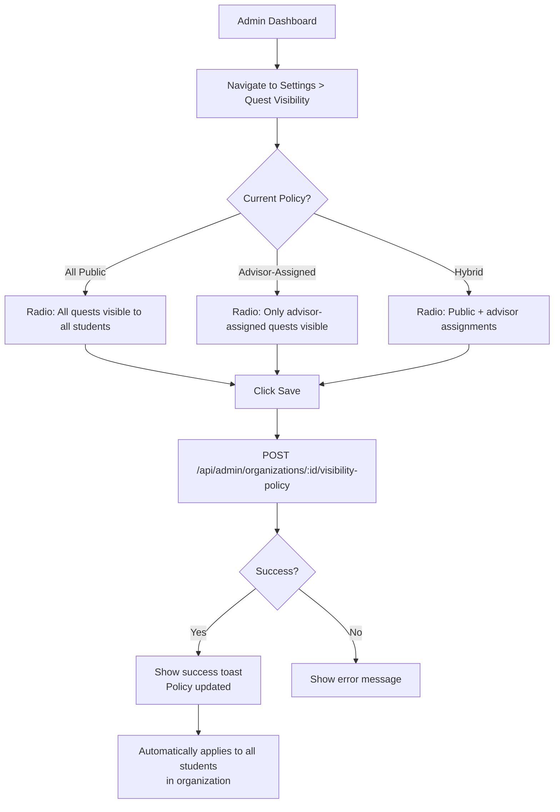
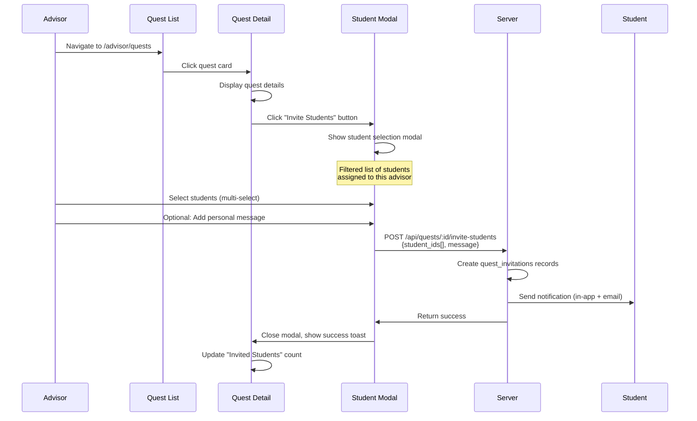
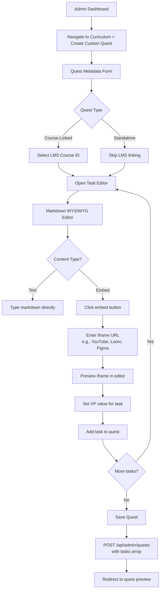
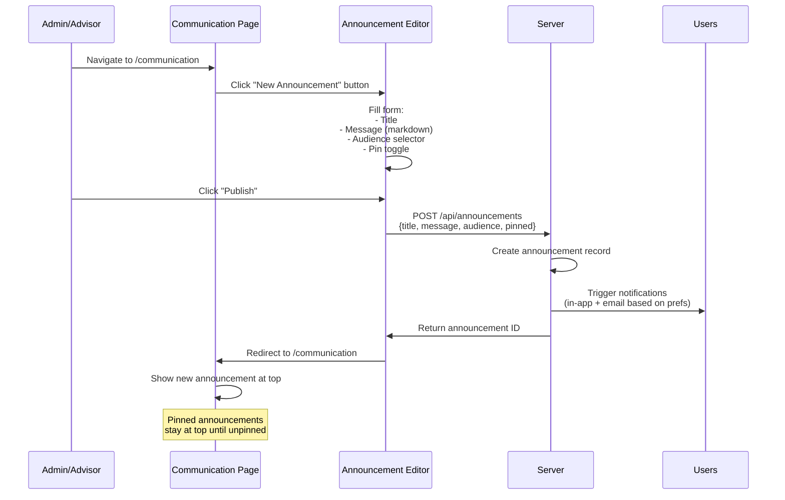
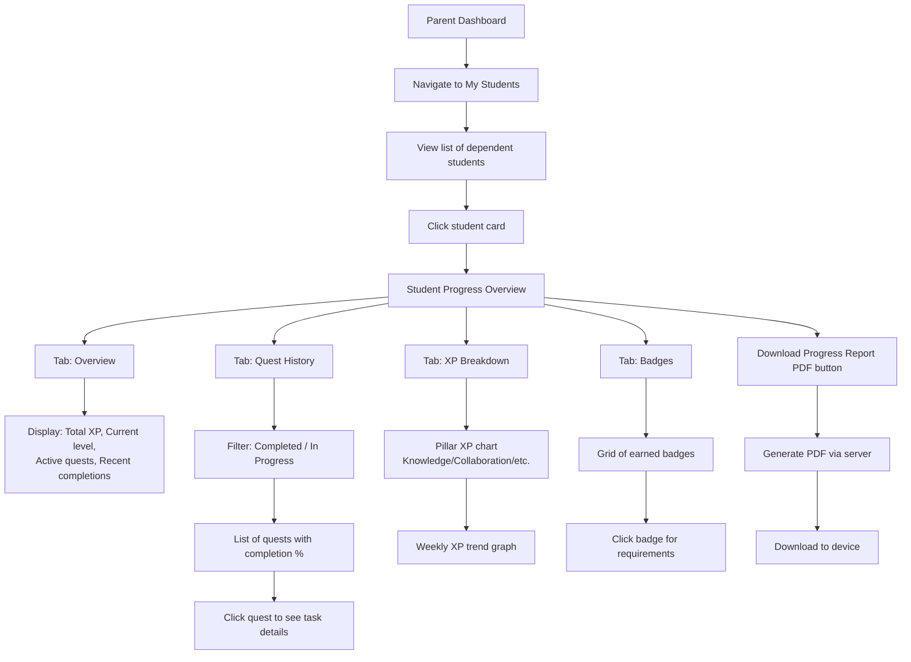

# LMS Feature UX Flows

**Last Updated**: December 27, 2025
**Target Users**: Superadmin, School Admin, Advisor, Parent/Observer, Student
**Branding**: Organization logo alongside Optio logo in navigation

---

## 1. Organization Signup Flow via Unique URL

### User Flow



### Wireframe Description

**Landing Page** (`/signup/:org_slug`)
- **Header**: Organization logo (left) | Optio logo (right)
- **Hero Section**: "Join [Org Name] on Optio" heading
- **Signup Form**:
  - Email input (validated)
  - Password input (8+ chars, show strength meter)
  - Display name input
  - Role selector dropdown:
    - Student (default)
    - Parent/Observer
    - Advisor
  - Hidden field: `organization_id` (auto-filled from slug)
  - Privacy policy checkbox
  - "Create Account" CTA button (org brand color)
- **Footer**: "Already have an account? Sign in"

**Error States**:
- Org slug invalid → "Organization not found"
- Org inactive → "This organization is not currently accepting signups"
- Email already exists → "Account exists. Try signing in."

---

## 2. School Admin Quest Visibility Management

### User Flow



### Wireframe Description

**Settings Page** (`/admin/settings/quest-visibility`)

**Navigation Breadcrumb**: Admin Dashboard > Settings > Quest Visibility

**Policy Selector Card**:
- **Heading**: "Quest Visibility Policy"
- **Description**: "Control which quests students in your organization can see and start."

**Radio Options** (large, card-style):
1. **All Quests Public**
   - Icon: Globe
   - Label: "All quests visible to all students"
   - Description: "Students can browse and start any active quest in the catalog."

2. **Advisor-Assigned Only**
   - Icon: Lock
   - Label: "Only advisor-assigned quests"
   - Description: "Students only see quests their advisor has explicitly assigned to them."

3. **Hybrid Mode**
   - Icon: Mix
   - Label: "Public catalog + advisor assignments"
   - Description: "Students see public quests AND advisor-assigned quests (recommended)."

**Current Policy Badge**: Displayed at top (e.g., "Current: Hybrid Mode")

**Action Buttons**:
- "Save Changes" (primary, disabled until change made)
- "Cancel" (secondary)

**Preview Section**:
- Shows sample student view based on selected policy
- Example: "Students will see: [Quest Card 1] [Quest Card 2] [+3 more]"

---

## 3. Advisor Inviting Students to Quests Workflow

### User Flow



### Wireframe Description

**Quest Detail Page** (`/advisor/quests/:id`)

**Header**:
- Quest title
- Quest type badge (Course-Linked / Standalone)
- "Invite Students" button (primary action, top-right)

**Main Content**:
- Quest description
- Task list preview (first 3 tasks)
- XP total
- "Invited Students" section:
  - Avatar list of already-invited students
  - Click to see full list

**Invite Students Modal**:
- **Header**: "Invite Students to [Quest Name]"
- **Student List**:
  - Search bar: "Search students by name..."
  - Multi-select checkboxes with student avatars/names
  - Show only students assigned to this advisor
  - Display student current XP level for context
- **Message Field** (optional):
  - Textarea: "Add a personal message (optional)"
  - Placeholder: "This quest will help you master..."
  - Character limit: 500
- **Actions**:
  - "Send Invitations" button (shows count: "Invite 5 students")
  - "Cancel" button

**Success State**:
- Toast: "5 students invited successfully!"
- Invited students appear in "Invited Students" section immediately
- Send button disabled for 2 seconds to prevent double-submit

**Student Notification** (Student Dashboard):
- In-app badge on bell icon
- Email: "[Advisor Name] invited you to [Quest Name]"
- CTA button in email: "View Quest"

---

## 4. Custom Curriculum Editor (Markdown WYSIWYG with iframe embeds)

### User Flow



### Wireframe Description

**Curriculum Editor** (`/admin/curriculum/create`)

**Page Layout**: Split-screen (50/50)

**Left Panel: Editor**
- **Quest Metadata Section**:
  - Quest title input
  - Quest type selector (Course-Linked / Standalone)
  - If Course-Linked: LMS Course dropdown
  - Organization visibility toggle (Public / Private)

- **Task List Builder**:
  - "Add Task" button (opens task editor below)
  - Sortable task list (drag to reorder)

- **Task Editor** (per task):
  - Task title input
  - Pillar selector dropdown (Knowledge / Collaboration / Metacognition / Reflection)
  - XP value slider (10-100 XP)
  - **Content Editor** (Markdown WYSIWYG):
    - Toolbar:
      - Bold, Italic, Heading, List, Link
      - **Embed Button** (prominent):
        - Opens modal: "Paste iframe URL or embed code"
        - Supports: YouTube, Loom, Figma, Google Slides, etc.
        - Auto-sanitizes iframe (removes unsafe attributes)
      - Code block, Quote
    - Live preview toggle
    - Character count (max 5000)
  - "Save Task" / "Cancel" buttons

**Right Panel: Live Preview**
- Shows student-facing view of quest/task
- Updates in real-time as user types
- Iframes render with responsive sizing
- XP badges display correctly

**Action Bar** (bottom):
- "Save Draft" (auto-saves every 30 seconds)
- "Preview as Student" (opens modal)
- "Publish Quest" (primary CTA)

**Embed Modal**:
- Input field: "Paste embed URL or iframe code"
- Supported platforms shown as icons (YouTube, Vimeo, Loom, Figma)
- Preview of iframe after paste
- "Insert" button

**Security**: All iframe embeds sanitized via DOMPurify, only allow whitelisted domains.

---

## 5. Announcement System

### User Flow



### Wireframe Description

**Communication Page** (`/communication`)

**Header**:
- "Announcements" heading
- "New Announcement" button (Admin/Advisor only)
- Filter dropdown: "All / Pinned / My Announcements"

**Announcement List**:
- **Pinned Section** (if any exist):
  - Badge: "Pinned"
  - Different background color (light purple)
  - Pin icon

- **Regular Announcements**:
  - Card layout:
    - Avatar of author (admin/advisor)
    - Title (bold)
    - Timestamp (relative: "2 hours ago")
    - First 150 chars of message
    - "Read more" link if truncated
    - Reaction buttons: Like, Bookmark (students only)
  - Pagination: 20 per page

**Announcement Detail Modal** (click card to open):
- Full title
- Author name + avatar
- Full message (markdown rendered)
- Timestamp (full date)
- Actions (admin/advisor only):
  - Edit button
  - Delete button
  - Pin/Unpin toggle

**New Announcement Form**:
- **Title** input (required, max 100 chars)
- **Message** textarea (markdown supported, max 2000 chars)
  - Live preview toggle
- **Audience Selector** (multi-select):
  - All organization members
  - Students only
  - Parents/Observers only
  - Advisors only
  - Specific user groups (if org has groups)
- **Pin Announcement** toggle (max 3 pinned at a time)
- **Notification Settings**:
  - Checkbox: "Send email notification" (default: checked)
  - Checkbox: "Send in-app notification" (default: checked)
- **Action Buttons**:
  - "Publish" (primary)
  - "Save Draft" (secondary)
  - "Cancel"

**Permissions**:
- Superadmin: Can post to any org, edit/delete any announcement
- School Admin: Can post org-wide, edit/delete own + org announcements
- Advisor: Can post to assigned students only
- Students/Parents: Read-only

---

## 6. Parent Progress Report Viewing

### User Flow



### Wireframe Description

**Parent Dashboard** (`/parent/dashboard`)

**My Students Section**:
- Card grid of dependent students
- Each card shows:
  - Student avatar + name
  - Current level badge
  - Total XP
  - Active quests count
  - "View Progress" button

**Student Progress Page** (`/parent/students/:student_id`)

**Header**:
- Back button to dashboard
- Student name + avatar
- Time period selector (Last 7 days / 30 days / All time)
- "Download Report" button (generates PDF)

**Tab Navigation**:
1. **Overview Tab** (default):
   - **Stats Cards** (4 across):
     - Total XP (large number + level)
     - Quests Completed (number + percentage of available)
     - Current Streak (days)
     - Avg XP per week

   - **Active Quests Section**:
     - List of in-progress quests
     - Progress bar per quest
     - "View Details" link

   - **Recent Activity Feed**:
     - Timeline of last 10 completions
     - Task name, XP earned, timestamp
     - Avatar of collaborators (if any)

2. **Quest History Tab**:
   - Filter: Completed / In Progress / All
   - Sort: Recent / Oldest / XP (high-low)
   - **Quest Cards**:
     - Quest title
     - Completion percentage
     - Tasks completed count
     - Total XP earned
     - Completed date (if done)
     - Expand to see task list with checkmarks

3. **XP Breakdown Tab**:
   - **Pillar Distribution** (Donut chart):
     - Knowledge (purple)
     - Collaboration (pink)
     - Metacognition (blue)
     - Reflection (green)
   - **Weekly Trend** (Line graph):
     - X-axis: Weeks
     - Y-axis: XP earned
     - Stacked by pillar
   - **Top Performing Pillars** (List):
     - Rank pillars by XP
     - Show percentage of total

4. **Badges Tab**:
   - Grid layout of all badges
   - **Earned Badges** (color):
     - Badge image
     - Badge name
     - Earned date
     - Click for requirements modal
   - **Not Earned** (grayscale):
     - Badge image (faded)
     - Badge name
     - "Locked" badge
     - Progress toward unlock (if applicable)

**Download Report Feature**:
- Generates PDF with:
  - Header: Optio + Org logos, student name, date range
  - Summary stats (same as Overview tab)
  - Quest completion list
  - XP breakdown chart
  - Badges earned
  - Footer: "Generated via Optio Education"
- Endpoint: `GET /api/observers/student/:id/report?format=pdf&period=30days`

**Permissions**:
- Parents can only view dependents they created (managed_by_parent_id)
- Observers (teachers) can view assigned students
- Data is read-only (no editing student progress)

---

## Implementation Priorities

### Phase 1 (Core LMS Foundation)
1. Organization signup flow
2. School admin quest visibility management
3. Parent progress report viewing

### Phase 2 (Advisor Tools)
4. Advisor inviting students to quests
5. Announcement system (basic)

### Phase 3 (Advanced Content Creation)
6. Custom curriculum editor with iframe embeds
7. Announcement system (full features: drafts, scheduling)

---

## Technical Notes

### Database Schema Requirements

**New Tables**:
- `quest_invitations` (id, quest_id, student_id, advisor_id, message, status, created_at)
- `announcements` (id, author_id, organization_id, title, message, audience, pinned, created_at)
- `announcement_reads` (id, announcement_id, user_id, read_at)

**Modified Tables**:
- `organizations`: Add `quest_visibility_policy` enum ('all_public', 'advisor_assigned', 'hybrid')
- `user_quest_tasks`: Add `content_markdown` TEXT, `iframe_embeds` JSONB

### API Endpoints

```
POST   /api/auth/register?org_slug=:slug
PATCH  /api/admin/organizations/:id/visibility-policy
POST   /api/quests/:id/invite-students
GET    /api/advisor/my-students
POST   /api/admin/quests (with embedded tasks)
POST   /api/announcements
GET    /api/announcements?organization_id=:id&audience=:role
GET    /api/observers/student/:id/report?format=pdf
```

### Security Considerations

1. **Iframe Sanitization**: Whitelist allowed domains (YouTube, Vimeo, Loom, Figma, etc.), strip all `<script>` tags
2. **Organization Isolation**: Enforce RLS policies to prevent cross-org data leaks
3. **Role-Based Access**: Advisors can only invite students assigned to them
4. **PDF Generation**: Rate-limit to prevent abuse (max 10 reports per hour)

### UX Best Practices

- All forms have loading states + error handling
- Auto-save for curriculum editor (prevent data loss)
- Mobile-responsive layouts for all pages
- Dark mode support (use CSS variables)
- Keyboard navigation for accessibility
- Screen reader labels for all interactive elements

---

## Related Files

- [LOCAL_DEVELOPMENT.md](../LOCAL_DEVELOPMENT.md) - Local setup
- [CLAUDE.md](../CLAUDE.md) - Project guide
- [core_philosophy.md](../core_philosophy.md) - Design principles
